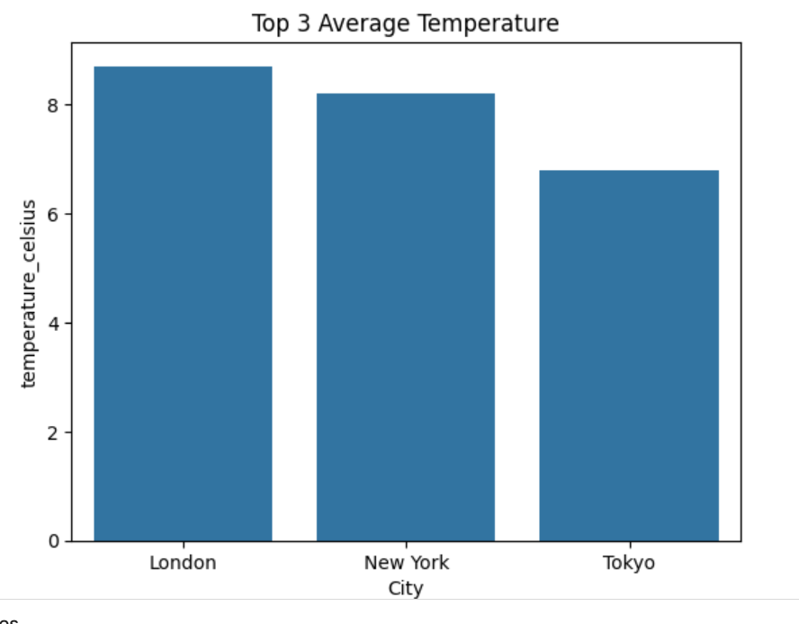

# Weather Pipeline

This project is a data pipeline that ingests raw weather data, performs cleaning and transformation, and saves the processed data as a CSV file.

## How to Run the Pipeline Locally

### Prerequisites

- Python 3.8 or higher installed on Windows  
- `pip` for package management

### Setup Instructions

### Clone the repository

git clone https://github.com/SelamZem/Weather.git
cd weather-pipeline
### Create and activate a virtual environment
python -m venv .venv
.venv\Scripts\activate
### Install dependencies
pip install -r requirements.txt
### Add your data
Place your raw weather CSV file in the data\ directory. 
### Run the pipeline
python main.py
### Check the output
After successful execution, the cleaned data will be saved in:
outputs\transformed_weather_data.csv

## Project Approach and Challenges
### Approach
[Weather Data Exploration and - Google Colab](https://colab.research.google.com/drive/1PFLOKDjUE8xqPGqheCPE5t5jnb4xbuoo?usp=sharing)

### Challenges
Pandas Warning: Used .copy() and .loc[] to avoid SettingWithCopyWarning during data transformations.
Only 3 cities are available to explore

